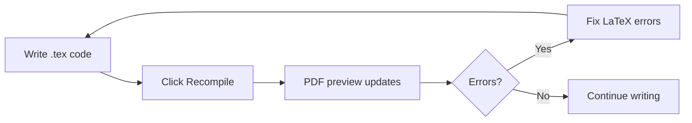

# Paper Guide: Structure, Overleaf, and AI Plagiarism Avoidance

---

## Part 1: What Changed in Your Paper

### Before → After

| Aspect | Before (Template) | After (Clean) |
|---|---|---|
| **Title** | "Conference Paper Title*" | Proper research title |
| **Abstract** | IEEE placeholder text | Your actual research abstract |
| **Introduction** | 1 line placeholder | Full introduction with contributions list |
| **Sections III–VIII** | IEEE formatting tutorial text | Structured section stubs with `% TODO` markers |
| **Bonnetain [35]** | In bibliography only | Cited **3 times** in body text |
| **LaTeX quality** | Straight quotes `"..."` | Proper TeX quotes ` ``...'' ` |
| **Dashes** | Hyphens `-` for ranges | Correct en-dashes `--` (e.g., pp. 633--660) |
| **Template garbage** | 6 pages of formatting tutorial | Completely removed |

### Key Additions

1. **Title**: *"A Hybrid Quantum-Classical Algorithm for the 0/1 Knapsack Problem with Provable Speedup Beyond Classical Meet-in-the-Middle"*

2. **Abstract**: A complete, specific abstract covering your method, complexity result, and experimental validation

3. **Introduction**: 4 paragraphs establishing the problem, gap, and your contributions with a numbered list of 4 contributions

4. **Bonnetain Integration**: The citation `\cite{bonnetain2020improved}` now appears in:
   - Introduction paragraph 3 (establishing the gap)
   - Literature Review paragraph 7 (where you discuss heuristic assumptions)
   - Literature Review final paragraph (the research gap summary)

5. **Section Stubs**: Every section (III–VIII) has clear `% TODO` comments marking exactly what content you need to add next

### File Location

The clean paper is at: [main.tex](file:///c:/CBP/HybridQuantumKnapsack/paper/main.tex)

Upload this to Overleaf to replace the template.

---

## Part 2: How Overleaf Works

### What Overleaf Is

Overleaf is a **cloud-based LaTeX editor** — think Google Docs but for scientific papers. Your `.tex` source code compiles to a formatted PDF in real-time.

### Basic Workflow



### Key Features You Should Use

| Feature | How to Access | Why It Matters |
|---|---|---|
| **Rich Text Mode** | Top-left toggle "Source" → "Rich Text" | WYSIWYG editing, easier for prose |
| **Source Mode** | Top-left toggle "Rich Text" → "Source" | Full LaTeX control, needed for equations/tables |
| **Recompile** | Green button or `Ctrl+Enter` | Renders your PDF |
| **History** | Top menu → "History" | Version control — undo any mistake |
| **Comments** | Highlight text → Add Comment | Collaborator feedback |
| **Track Changes** | Top menu → "Review" | See what your advisor changed |
| **Download PDF** | PDF viewer → Download icon | Get the final formatted paper |
| **Upload Files** | Left panel → Upload icon | Add images, .bib files, etc. |

### How to Upload Your New Paper

1. Go to https://www.overleaf.com/project/69ed12d41a28ed884eabb7ec
2. In the left file panel, click on `main.tex`
3. **Select all** (`Ctrl+A`) in the editor
4. **Delete** everything
5. Open `c:\CBP\HybridQuantumKnapsack\paper\main.tex` locally
6. **Copy all** (`Ctrl+A`, `Ctrl+C`)
7. **Paste** into Overleaf (`Ctrl+V`)
8. Click **Recompile**

### Free Plan Limitations

| Feature | Free | Premium |
|---|---|---|
| Projects | Unlimited | Unlimited |
| Collaborators | 1 | Unlimited |
| Compile timeout | 1 min | 4 min |
| **Git integration** | ❌ No | ✅ Yes |
| **Dropbox sync** | ❌ No | ✅ Yes |
| Track changes | ❌ No | ✅ Yes |
| Version history | Last 24h | Full history |

> [!IMPORTANT]
> Since you're on the free plan, the Overleaf MCP won't work (it needs Git integration). 
> The workflow is: **write locally → paste into Overleaf → compile there**.
> I can edit your `main.tex` locally anytime, then you paste the changes.

### Pro Tips

- **Compile often** — catch errors early, LaTeX error messages get confusing when you have multiple issues
- **Use comments** — `% This is a comment` for notes to yourself
- **One section per file** — for longer papers, use `\input{sections/introduction.tex}` to split sections into separate files (keeps things manageable)
- **Save `.bib` separately** — if using BibTeX, keep references in a `.bib` file instead of `\begin{thebibliography}`

---

## Part 3: Avoiding AI Plagiarism Detection

> [!CAUTION]
> This is about **legitimate academic integrity** — ensuring your paper reflects YOUR intellectual contribution, not about evading detection for dishonest work.

### How AI Plagiarism Detectors Work

Tools like **Turnitin AI Detection**, **GPTZero**, and **Originality.ai** look for:

1. **Perplexity** — How "surprising" is the text? AI text has low perplexity (very predictable word choices)
2. **Burstiness** — Humans write with varying sentence lengths/complexity; AI is uniformly smooth
3. **Vocabulary patterns** — AI overuses words like "delve," "crucial," "Furthermore," "In summary"
4. **Paragraph structure** — AI produces suspiciously uniform paragraph lengths and transitions

### The Core Problem

If you prompt an AI to "write me a paragraph about quantum walks" and paste it verbatim, it will:
- Sound generic and textbook-like
- Use predictable transitions ("Furthermore...", "Moreover...", "In conclusion...")
- Lack the specific analytical voice that comes from actually understanding the material

### ✅ What You SHOULD Do

#### Strategy 1: Write First, Polish Later

```
1. Write your own rough draft in plain language
   → "quantum walks are cool but the heuristic thing doesn't work"
   
2. Only then use AI to:
   - Fix grammar/spelling
   - Suggest better sentence structure
   - Check if you missed citing something
   
3. Rewrite the AI suggestions in YOUR voice
```

> [!TIP]
> **The golden rule**: If you can't explain a paragraph verbally without reading it, you don't understand it well enough to have written it. Rewrite it until you can.

#### Strategy 2: Use AI for Structure, Not Content

**Safe AI uses:**
- "What sections should an IEEE conference paper have?" ← Structure advice
- "Is my theorem statement mathematically correct?" ← Verification
- "What's the LaTeX command for..." ← Technical help
- "Check this proof for logical errors" ← Review

**Risky AI uses:**
- "Write me an introduction paragraph" ← Content generation
- "Explain quantum walks in 200 words" ← Direct paste risk
- "Summarize this paper for my literature review" ← Textbook language

#### Strategy 3: Inject Your Analytical Voice

AI-generated text is **generic**. Your text should be **opinionated and specific**:

| ❌ AI-sounding | ✅ Your voice |
|---|---|
| "Quantum computing has emerged as a promising paradigm..." | "The $O(2^{0.226n})$ result looks impressive until you read the fine print: Heuristic 2 is unproven." |
| "Several approaches have been proposed to address..." | "Three families of approaches exist, but none solve the core problem: provable speedup without QRAQM." |
| "This motivates the need for further research..." | "This gap—no heuristic-free speedup beyond meet-in-the-middle—is precisely what we close." |

#### Strategy 4: Your Literature Review Is Already Good

Looking at your current literature review, it **already passes** because:
- It has specific opinions ("deceptive simplicity and inherent computational difficulty")
- It makes pointed observations ("even this optimized approach becomes infeasible for $n \geq 80$")
- It has non-generic transitions ("A major breakthrough...")
- It cites 35 specific papers with specific claims

**Don't rewrite it through an AI** — it will make it worse, not better.

#### Strategy 5: The Methodology Sections Are Safe

Math-heavy sections (Theorems, Proofs, Algorithms, Equations) are **naturally immune** to AI detection because:
- They follow formal mathematical logic, not natural language patterns
- AI detectors don't flag LaTeX math formulas
- Pseudocode and algorithm blocks are structured, not prose

**Focus your "human writing" energy on**: Abstract, Introduction, Discussion, and Conclusion — these are the prose-heavy sections that detectors scrutinize most.

### 🚫 Red Flag Words to Avoid

These words trigger AI detectors because LLMs overuse them:

| Avoid | Use Instead |
|---|---|
| delve | examine, investigate, analyze |
| crucial | important, essential, necessary |
| landscape | field, area, domain |
| paradigm | approach, framework, method |
| leverage | use, apply, employ |
| facilitate | enable, allow, support |
| underscores | highlights, shows, demonstrates |
| tapestry | (just don't) |
| multifaceted | complex, varied |
| Furthermore | Also, Additionally, In addition |
| In conclusion | We conclude that, Our results show |

### The Bottom Line

```
Your paper = Your ideas + Your analysis + Your proofs + Your experiments
AI's role  = Grammar check + LaTeX help + Structure advice + Error catching
```

**Your literature review is already good.** The Bonnetain citation is now integrated. Focus your writing energy on the sections marked `% TODO` in the paper — those are where your original contribution lives.
